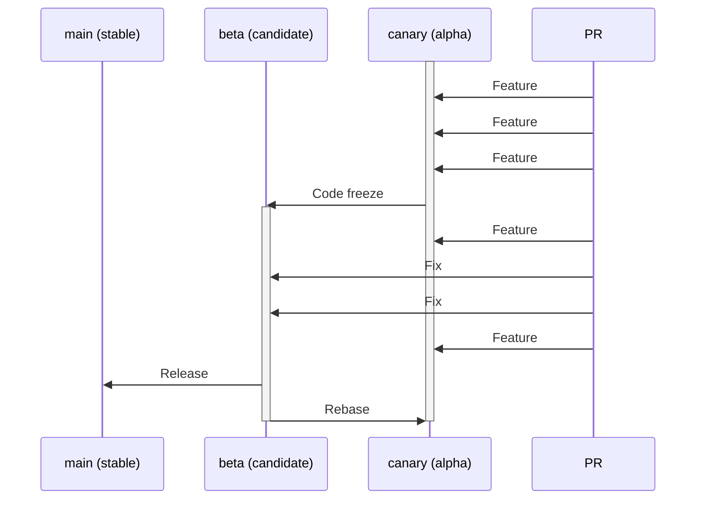

# How to Contribute

We're always looking for people to help make Listenarr even better! There are a number of ways to contribute, from documentation to development.

## Documentation

Setup guides, FAQ, troubleshooting tips - the more information we have in the documentation, the better. Help us improve:

- [Wiki](https://github.com/Listenarrs/Listenarr//wiki) (coming soon)
- Code comments and inline documentation
- README improvements
- Tutorial videos or blog posts

- Canonical contributor guidance and AI-agent rules: see `.github/AGENTS.md`, `.github/CLAUDE.md` and `.github/RULES.md`
## Development

### Tools Required

- **Visual Studio 2022** or higher ([https://www.visualstudio.com/vs/](https://www.visualstudio.com/vs/)). The community version is free and works fine.
- **Rider** (optional alternative to Visual Studio, preferred by many) ([https://www.jetbrains.com/rider/](https://www.jetbrains.com/rider/))
- **VS Code** (recommended for frontend) ([https://code.visualstudio.com/](https://code.visualstudio.com/))
- **Git** ([https://git-scm.com/downloads](https://git-scm.com/downloads))
- **Node.js** (Node 24.x or higher) ([https://nodejs.org/](https://nodejs.org/))
- **.NET 10.0 SDK or higher** ([https://dotnet.microsoft.com/download](https://dotnet.microsoft.com/download))

### Getting Started

1. **Fork Listenarr** on GitHub
2. **Clone** the repository to your development machine
   ```bash
   git clone https://github.com/YOUR-USERNAME/Listenarr.git
   cd Listenarr
   ```
3. **Install root dependencies** (for concurrently)
   ```bash
   npm install
   ```
4. **Install frontend dependencies**
   ```bash
   cd fe
   npm install
   cd ..
   ```
5. **Restore .NET dependencies**
   ```bash
   cd listenarr.api
   dotnet restore
   cd ..
   ```
   If you previously ran Listenarr with local files under `listenarr.api/config`, delete that folder. Development config now lives under `.env/development`, and `listenarr.api/config` should not be used for local configuration.
6. **Start development servers**
  Option A - Single command (recommended, runs both API and web):
  ```bash
  npm run dev
  ```

  Option B - Start services separately (useful for backend debugging):
  ```bash
  # Terminal 1 - Backend (fast restart on code changes)
  cd listenarr.api
  dotnet watch run

  # Terminal 2 - Frontend
  cd fe
  npm run dev
  ```

7. **Open your browser**
   - Frontend: [http://localhost:5173](http://localhost:5173)
   - Backend API: [http://localhost:4545](http://localhost:4545)

### Debugging

#### Visual Studio / Rider
1. Open `listenarr.slnx` in Visual Studio or Rider
2. Set `listenarr.api` as the startup project
3. Press F5 to start debugging
4. The API will be available at [http://localhost:4545](http://localhost:4545)

Note: there is also a `watch` task available in the workspace tasks that runs `dotnet watch run` across the solution when you prefer a single task for backend hot-reloads.

#### VS Code
1. Open the root folder in VS Code
2. Use the provided launch configurations in `.vscode/launch.json`
3. Press F5 to start debugging both frontend and backend

#### Debugging on Mobile/Other Devices
- Update the API URL in `fe/src/services/api.ts` to use your development machine's IP address instead of `localhost`
- Example: `http://192.168.1.100:4545` instead of `http://localhost:4545`

### Contributing Code

**Before you start:**
- If you're adding a new feature, please check [GitHub Issues](https://github.com/Listenarrs/Listenarr/issues) to see if it's already requested
- Comment on the issue so work isn't duplicated
- If adding something not already requested, please create an issue first to discuss it
- Reach out on [Discussions](https://github.com/Listenarrs/Listenarr/discussions) if you have questions

 - Run frontend tests: `cd fe && npm test` (the frontend uses Vitest/Vite; check `fe/package.json` for exact scripts)
- Rebase from Listenarr's `canary` branch (contributors) or `beta` branch (org hotfixes), don't merge
- Make meaningful commits, or squash them before submitting PR
- Feel free to make a pull request before work is complete (mark as draft) - this lets us see progress and provide feedback
- Add tests where applicable (unit/integration)
- Commit with *nix line endings for consistency (We checkout Windows and commit *nix)
- One feature/bug fix per pull request to keep things clean and easy to understand

**Code style:**
- **Backend (C#)**: Use 4 spaces instead of tabs (default in VS 2022/Rider)
- **Frontend (Vue/TS)**: Use 2 spaces for indentation
- Follow existing code patterns and conventions
- Use meaningful variable and function names
- Add comments for complex logic

#### EF Core & DI guidance (important)
This project follows a layered pattern: domain models in `listenarr.domain`, EF mappings and DbContext in `listenarr.infrastructure`, and services/controllers in `listenarr.api`. Follow these rules when working with EF and DI:

- Where to add EF mappings:
  - Add EF model configuration and ValueConverters in `listenarr.infrastructure`. Keep database-specific concerns (migrations, pragmas, converters) in Infrastructure.
  - Centralized converters are in `listenarr.infrastructure/Persistence/Converters/JsonValueConverters.cs`. Add other shared converters there.

- DbContext registration:
  - Use `AddDbContextFactory<ListenArrDbContext>` for hosted/background services that need DbContext outside of HTTP request scope.
  - `AddListenarrInfrastructure` centralizes DbContext/IDbContextFactory registration and scoped `ListenArrDbContext` access. Add separate DbContext registrations only for explicit test overrides.

- Pattern for hosted services:
  - Inject `IDbContextFactory<ListenArrDbContext>` into hosted/background services and create contexts with `await factory.CreateDbContextAsync(cancellationToken)`.
  - Dispose contexts promptly and avoid storing DbContext as a field.

- Test host behavior:
  - Integration tests use `ListenarrWebApplicationFactory` and `Program.Testing.cs` / `ApplyTestHostPatches` for isolated test-host setup and test-specific overrides (e.g. a test SQLite path).
  - Disable or mock heavy external installers/services in the test host by overriding DI or configuration.
  - This prevents CI/tests from spawning external processes while keeping DI consistent.

- New adapters / HttpClients:
  - Register typed or named HttpClients directly in `listenarr.api/Program.cs`, or centralize them in `AddListenarrHttpClients` (`listenarr.infrastructure/Extensions/ServiceRegistrationExtensions.cs`).
  - Register adapter interfaces in the adapters module (see `listenarr.infrastructure/Extensions/ServiceRegistrationExtensions.cs`).
  - If adapter resolution by id/type is required, use `IDownloadClientAdapterFactory`.

- Testing tips:
  - Add unit tests for ValueConverters and ValueComparers to ensure JSON behavior is stable (null handling, empty JSON).
  - Follow `tests/README.md`; backend tests should default to `BaseTests`, repository helpers, DI-resolved services/controllers, and builders such as `AudiobookBuilder` and `ApplicationSettingsBuilder`. Hand-wire setup only for test-specific overrides.
  - Use `WebApplicationFactory<Program>` for integration tests and apply `WithWebHostBuilder` when you need to override services.
  - Use the test-host patching approach to keep tests hermetic (no external network or process calls).

**Testing:**
- Run backend tests: `dotnet test`
- Run frontend tests: `cd fe && npm run test:unit`
- Run frontend type checks: `cd fe && npm run type-check`
- Ensure all tests pass before submitting PR

### Branching Model

Listenarr follows a **canary → beta → main** release flow:



| Branch | Role | Who merges here |
|---|---|---|
| `canary` | Alpha — all new feature work | **All contributors** via PR |
| `beta` | Release candidate — stabilisation only | **Org members only** via PR (fixes) |
| `main` | Stable release | CI release workflow only |

**Lifecycle in detail:**
1. Feature PRs from contributors (and org members) are always opened against `canary`.
2. When enough features have accumulated, an org member performs a **code freeze**: `canary` is merged into `beta` to create a release candidate.
3. Feature work continues into `canary` uninterrupted during the beta window.
4. Org members open **fix PRs** targeting `beta` to stabilise the release candidate.
5. Once stable, `beta` is merged into `main` and a release tag is created.
6. After the release, `beta` is **rebased back into `canary`** so all fixes are carried forward.
7. PRs to `main` will be closed without review.

### Pull Request Guidelines

**Branch naming:**
- Always branch off the latest `canary` when starting new feature work
- Use meaningful branch names that describe what is being added/fixed
- **Strongly recommended**: include the issue number in your branch name — this encourages opening (and discussing) an issue before writing code, and makes it easy to cross-reference work

Good examples:
- `123-audible-integration`
- `456-download-queue`
- `789-fix-search-results`
- `feature/audible-integration`
- `feature/download-queue`
- `bugfix/search-results`
- `enhancement/ui-improvements`

Bad examples:
- `new-feature`
- `fix-bug`
- `patch`
- `beta`

**PR process:**
1. **Target branch**:
   - **Feature branches** → `canary` (all contributors)
   - **Hotfixes** → `beta` (org members only)
   - PRs to `main` will be commented on and closed
   - Never open a PR directly from `beta` or `canary` in your fork — always use a dedicated feature branch
   > **Note for maintainers:** The `Validate PR version label` check only blocks merges if it is registered as a required status check under **Settings → Branches → canary branch protection rule**. Without that, a PR without a version label can still be merged (the build will then fail at the canary workflow step instead).
2. **Description**: Provide a clear description of what your PR does
   - Reference related issues (e.g., "Fixes #123")
   - Include screenshots for UI changes
   - List breaking changes if any
3. **Review**: You'll probably get comments or questions from us
   - These are to ensure consistency and maintainability
   - Don't take them personally - we appreciate your contribution!
4. **Response time**: We'll try to respond as soon as possible
   - If it's been a few days without response, please ping us
   - We may have missed the notification

**PR checklist:**
- [ ] Code follows project style guidelines
- [ ] Self-review of code completed
- [ ] Comments added for complex logic
- [ ] Tests added/updated (if applicable)
- [ ] All tests pass
- [ ] No console errors or warnings
- [ ] Documentation updated (if needed)
- [ ] Rebased on latest `canary` branch (or `beta` for org hotfixes)

### API Documentation

If you want to explore the API using Swagger:

1. Start the backend API
   ```bash
   cd listenarr.api
   dotnet run
   ```
2. Navigate to [http://localhost:4545/swagger](http://localhost:4545/swagger)
3. You can test all API endpoints directly from the Swagger UI

### Project Structure

```
Listenarr/
├── fe/                       # Frontend (Vue.js)
│   ├── src/
│   │   ├── components/       # Reusable Vue components
│   │   ├── views/            # Page components
│   │   ├── stores/           # Pinia state management
│   │   ├── services/         # API client services
│   │   └── types/            # TypeScript type definitions
│   └── public/               # Static assets
├── listenarr.api/            # Backend API (ASP.NET Core / .NET 10)
|   ├── Attributes/           # Attributes to be used on endpoints
│   ├── Controllers/          # API endpoints
│   ├── Dtos/                 # Data transfer objects
│   ├── Filters/              # Filters for swagger generation 
│   ├── Middleware/           # Middleware to run on the request pipeline
│   └── Program.cs            # Application entry
├── listenarr.application/    # Application layer
|   ├── Audiobooks/           # Service revolving around Audiobooks management
│   ├── Common/             
│   ├── Downloads/            # Download related services
│   ├── Extensions/          
│   ├── Interfaces/           # Defines all application interface for other layers
│   ├── Mapping/              # Conversion between DTO and domain objects
│   ├── Metadata/             # Services to handle metadata
│   ├── Notification/         # Notification related services
│   ├── Search/               # All searching related services
│   └── Security/             # Security related services
├── listenarr.domain/         # Defines domain model
│   ├── Common/               # Static methods
│   └── Models/               # Domain objects
├── listenarr.infrastructure/ # Defines domain model
│   ├── Adapters/             # External download client implementations
│   ├── Cache/                # Caching implementations
│   ├── Extensions/           # Dpendancy injection extensions 
│   ├── Factories/            # External download client implementations
│   ├── Ffmpeg/               # Ffmpeg interface
│   ├── Filesystem/           # File system manipulations
│   ├── OpenLibrary/          # Open library interface
│   ├── Persistence/          # Data base interface
│   ├── Platform/             # Interface with the OS
│   ├── Search/               # Search providers interfaces
│   ├── Security/             # API security specificity
│   ├── Services/             
│   └── SignalR/              # SignalR notification interface
├── tests/                    # Backend tests
├── .github/                  # GitHub configuration
├── docker-compose.yml        # Docker setup
└── README.md                 # Main documentation
```

The following should be kept in mind while adding or moving files:
* **listenarr.api**: Organised by contracts
  * DTOs
  * Controllers
* **listenarr.application**: Organised by features
  * Interfaces
  * Downloads
  * Audiobooks
  * ...
* **listenarr.domain**: Organised by business logic, rules, behaviors
  * Models/Configurations
  * Models/Enumerations
  * Models/Exceptions
  * ...
* **listenarr.infrastructure**: Organised by technology
  * OpenLibrary
  * Persistence
  * SignalR
  * ...

Note: Those are general guidelines we will try to enforce during code review or discussions. The architecture is a WIP, currently, application holds most of the buisness and orchestration logic. The buisness logic should move progressively to the domain layer. Technical specifities should also be ported to the infrastructure when possible.


### Technology Stack

**Backend:**
- ASP.NET Core Web API
- Entity Framework Core with SQLite
- C# / .NET 10.0+

**Frontend:**
- Vue 3 (Composition API)
- TypeScript
- Pinia (state management)
- Vue Router
- Vite (build tool)

## Localization

We plan to support multiple languages in the future. If you'd like to help translate Listenarr into your language, please let us know on [Discussions](https://github.com/Listenarrs/Listenarr/discussions).

## Feature Requests

Got an idea for a new feature? Here's how to suggest it:

1. Check [GitHub Discussions](https://github.com/Listenarrs/Listenarr/discussions) to see if it's already been suggested
2. If not, create a new discussion in the "Ideas" category
3. Clearly describe the feature and why it would be useful
4. Include mockups or examples if applicable

## Bug Reports

Found a bug? Please report it!

1. Check [GitHub Issues](https://github.com/Listenarrs/Listenarr/issues) to see if it's already reported
2. If not, create a new issue with:
   - Clear title describing the bug
   - Steps to reproduce
   - Expected behavior
   - Actual behavior
   - Screenshots (if applicable)
   - Environment details (OS, browser, .NET version, Node version)

## Code of Conduct

### Our Pledge

We are committed to providing a welcoming and inspiring community for all. Please be respectful and constructive in your interactions with other contributors.

### Expected Behavior

- Be respectful and inclusive
- Provide constructive feedback
- Accept constructive criticism gracefully
- Focus on what's best for the community
- Show empathy towards other community members

### Unacceptable Behavior

- Harassment, discrimination, or offensive comments
- Personal attacks or insults
- Trolling or inflammatory comments
- Publishing others' private information
- Any conduct that would be inappropriate in a professional setting

## Questions?

If you have any questions about contributing, please:

1. Check the [Wiki](https://github.com/Listenarrs/Listenarr/wiki) (coming soon)
2. Ask in [GitHub Discussions](https://github.com/Listenarrs/Listenarr/discussions)
3. Open an issue if you think something is unclear in this guide

---

## Layering rules & migration steps (practical)
- Keep contracts (interfaces, DTOs, domain models) in `listenarr.application` or `listenarr.domain`.
- Keep framework-dependent implementations (EF Core, HttpClients, filesystem) in `listenarr.infrastructure`.
- `listenarr.api` should only compose services, host controllers, and register DI; do not add new interfaces that duplicate application/infrastructure contracts.
- Migration checklist for misplaced interface + implementation found in `listenarr.api`:
  1. Move the interface/DTO to `listenarr.application` or `listenarr.domain`.
  2. Move the concrete implementation to the appropriate `listenarr.infrastructure` feature/technology folder (for example `Cache`, `Filesystem`, or `Services` when no narrower home exists).
  3. Add registration in `listenarr.infrastructure/Extensions/InfrastructureServiceRegistrationExtensions.cs` (e.g., `services.AddScoped<IFoo, Foo>();`).
  4. In `listenarr.api/Program.cs` call the infrastructure registration extension instead of registering types inline.
  5. Delete the old API placeholder files and run `dotnet test` to verify no regressions.
- Add a small DI/registration unit test (DependencyInjectionTests) that asserts required services are resolvable; run it early in CI to catch layering regressions.

Thank you for contributing to Listenarr! 🎵📚
